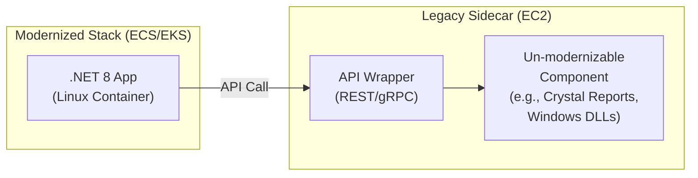

# .NET Framework to .NET 8 + AWS Modernization

## Platform Detection

### .NET-Specific Files to Detect

- `.sln` - Solution files
- `.csproj` / `.vbproj` - Project files
- `web.config` / `app.config` - Configuration files
- `packages.config` - Legacy NuGet packages
- `appsettings.json` - Modern configuration
- `Global.asax` - ASP.NET application file

### .NET-Specific Dependencies

- `System.Web.*` - ASP.NET Web Forms
- `System.Data.SqlClient` / `Microsoft.Data.SqlClient` - SQL Server
- `System.ServiceModel.*` - WCF
- `EntityFramework` / `Microsoft.EntityFrameworkCore` - ORM
- `System.DirectoryServices` / `System.DirectoryServices.AccountManagement` - Active Directory (⛔ Critical Blocker)

### Active Directory / SSO Detection

Scan `web.config` for authentication mode:
- `<authentication mode="Windows" />` → Windows SSO scenario (Critical Blocker - Complete Rewrite)
- `<authentication mode="Forms">` with `ValidateUser` or `PrincipalContext` in code → Forms Auth against AD (Remote Auth approach)

Scan source code for:
- `User.IsInRole()`, `WindowsIdentity`, `WindowsPrincipal` → Windows SSO
- `Membership.ValidateUser()`, `PrincipalContext`, `FormsAuthentication.SetAuthCookie()` → Forms Auth against AD

### Target Framework Detection

Extract from `.csproj` files:
- `<TargetFramework>net48</TargetFramework>` - .NET Framework 4.8
- `<TargetFramework>net6.0</TargetFramework>` - .NET 6
- `<TargetFramework>net8.0</TargetFramework>` - .NET 8

## .NET Modernization Decision Tree

The following decision tree defines the base logic for determining the modernization approach. When generating the report, walk through each decision node and map the actual findings from the codebase scan to show readers exactly which attributes were extracted and how they led to the recommended approach.

```mermaid
flowchart TD
    %% Nodes
    Start([Start: .NET Framework 4.8 App])

    %% Phase 1: Feasibility Check
    CheckTech{Uses Unsupported Tech?<br/>(AppDomains, Remoting, CAS,<br/>WF, COM+, WebForms, WCF-Server)}
    Redesign[Must Redesign/Replace<br/>Unsupported Components]
    StayFramework1[Stay on .NET Framework<br/>(Legacy Mode)]

    CheckPlatform{Tied to Platform?<br/>(SharePoint, BizTalk, etc.)}
    MigratePlatform[Migrate Platform First]
    StayFramework2[Stay on .NET Framework<br/>(Platform Constraint)]

    CheckLibs{Critical 3rd-Party Libs<br/>Lack Modern .NET Version?}
    ReplaceLibs[Replace/Port Libraries]
    StayFramework3[Stay on .NET Framework<br/>(Dependency Hell)]

    CheckOS{Target OS Supported<br/>by .NET 8?}
    UpgradeOS[Upgrade OS]
    StayFramework4[Stay on .NET Framework<br/>(OS Constraint)]

    %% Phase 2: Platform Selection
    MoveModern([Move to Modern .NET / .NET 8])

    CheckWinFeat{Needs Windows-Only Features?<br/>(WPF/WinForms, GDI+, Registry,<br/>Win-Specific P/Invoke)}
    TargetWinX86[Target: Windows x86/x64<br/>(No Graviton)]

    CheckWinDeps{Has Windows-Only Native Deps?<br/>(COM, win-x64 DLLs)}
    TargetLinuxCap([Linux Capable])

    %% Phase 3: Architecture Selection
    CheckArmSupport{All Libs/Agents Support<br/>linux-arm64?}
    TargetLinuxX86[Target: Linux x86-64<br/>(Step 1)]

    CheckWorkload{CPU-Bound / High Scale?<br/>(Crypto, API, Batch)}
    TargetGraviton[Target: AWS Graviton / ARM64<br/>(Best Performance/Cost)]
    TargetLinuxChoice[Choice: Linux x86 OR Graviton<br/>(Based on Ops Preference)]

    %% Edges / Logic Flow
    Start --> CheckTech
    CheckTech -- Yes --> Redesign
    Redesign --> CheckTech
    CheckTech -- Cannot Fix --> StayFramework1
    CheckTech -- No --> CheckPlatform

    CheckPlatform -- Yes --> MigratePlatform
    MigratePlatform --> CheckPlatform
    CheckPlatform -- Cannot Fix --> StayFramework2
    CheckPlatform -- No --> CheckLibs

    CheckLibs -- Yes --> ReplaceLibs
    ReplaceLibs --> CheckLibs
    CheckLibs -- Cannot Fix --> StayFramework3
    CheckLibs -- No --> CheckOS

    CheckOS -- No --> UpgradeOS
    UpgradeOS --> CheckOS
    CheckOS -- Cannot Upgrade --> StayFramework4
    CheckOS -- Yes --> MoveModern

    MoveModern --> CheckWinFeat
    CheckWinFeat -- Yes --> TargetWinX86
    CheckWinFeat -- No --> CheckWinDeps
    CheckWinDeps -- Yes --> TargetWinX86
    CheckWinDeps -- No --> TargetLinuxCap

    TargetLinuxCap --> CheckArmSupport
    CheckArmSupport -- No --> TargetLinuxX86
    CheckArmSupport -- Yes --> CheckWorkload
    CheckWorkload -- Yes --> TargetGraviton
    CheckWorkload -- No --> TargetLinuxChoice

    %% Styling
    classDef termination fill:#f9f9f9,stroke:#333,stroke-width:2px;
    classDef decision fill:#e1f5fe,stroke:#01579b,stroke-width:2px;
    classDef process fill:#fff9c4,stroke:#fbc02d,stroke-width:2px;
    classDef success fill:#e8f5e9,stroke:#2e7d32,stroke-width:4px;
    classDef failure fill:#ffebee,stroke:#c62828,stroke-width:2px;

    class Start,MoveModern,TargetLinuxCap termination;
    class CheckTech,CheckPlatform,CheckLibs,CheckOS,CheckWinFeat,CheckWinDeps,CheckArmSupport,CheckWorkload decision;
    class Redesign,MigratePlatform,ReplaceLibs,UpgradeOS process;
    class TargetGraviton,TargetWinX86,TargetLinuxX86,TargetLinuxChoice success;
    class StayFramework1,StayFramework2,StayFramework3,StayFramework4 failure;
```

### Decision Tree Mapping Instructions

When generating the modernization report, include a **Decision Tree Findings Map** section that walks through each node and shows:

| Decision Node | What We Scanned | What We Found | Result |
|---------------|-----------------|---------------|--------|
| Unsupported Tech? | `.csproj` refs, `Global.asax`, code patterns | _(e.g., "WebForms detected: 12 .aspx pages")_ | Yes/No |
| Tied to Platform? | Project refs, NuGet packages | _(e.g., "No SharePoint/BizTalk dependencies")_ | Yes/No |
| Critical Libs Missing? | `packages.config`, `.csproj` PackageReference | _(e.g., "All packages have .NET 8 versions")_ | Yes/No |
| Target OS Supported? | Runtime dependencies, P/Invoke calls | _(e.g., "No OS-specific constraints")_ | Yes/No |
| Windows-Only Features? | WPF/WinForms refs, GDI+, Registry calls | _(e.g., "No Windows-only UI frameworks")_ | Yes/No |
| Windows-Only Native Deps? | COM references, native DLL imports | _(e.g., "No COM interop detected")_ | Yes/No |
| ARM64 Support? | NuGet native packages, agent dependencies | _(e.g., "All deps support linux-arm64")_ | Yes/No |
| CPU-Bound / High Scale? | Application profile, workload patterns | _(e.g., "API-heavy, high request volume")_ | Yes/No |

Highlight the path taken through the decision tree by marking the actual route with ✅ and dead-end branches with ❌. This gives readers full transparency into why a specific target platform and architecture was recommended.

## .NET Modernization Decision Tree

Use this decision tree as the base logic for the analysis. When generating the report, map actual findings from the codebase scan onto each decision node to show readers exactly which attributes were extracted and how they led to the recommended approach.

```mermaid
flowchart TD
    %% Nodes
    Start([Start: .NET Framework 4.8 App])

    %% Phase 1: Feasibility Check
    CheckTech{Uses Unsupported Tech?<br/>(AppDomains, Remoting, CAS,<br/>WF, COM+, WebForms, WCF-Server)}
    Redesign[Must Redesign/Replace<br/>Unsupported Components]
    StayFramework1[Stay on .NET Framework<br/>(Legacy Mode)]

    CheckPlatform{Tied to Platform?<br/>(SharePoint, BizTalk, etc.)}
    MigratePlatform[Migrate Platform First]
    StayFramework2[Stay on .NET Framework<br/>(Platform Constraint)]

    CheckLibs{Critical 3rd-Party Libs<br/>Lack Modern .NET Version?}
    ReplaceLibs[Replace/Port Libraries]
    StayFramework3[Stay on .NET Framework<br/>(Dependency Hell)]

    CheckOS{Target OS Supported<br/>by .NET 8?}
    UpgradeOS[Upgrade OS]
    StayFramework4[Stay on .NET Framework<br/>(OS Constraint)]

    %% Phase 2: Platform Selection
    MoveModern([Move to Modern .NET / .NET 8])

    CheckWinFeat{Needs Windows-Only Features?<br/>(WPF/WinForms, GDI+, Registry,<br/>Win-Specific P/Invoke)}
    TargetWinX86[Target: Windows x86/x64<br/>(No Graviton)]

    CheckWinDeps{Has Windows-Only Native Deps?<br/>(COM, win-x64 DLLs)}
    TargetLinuxCap([Linux Capable])

    %% Phase 3: Architecture Selection
    CheckArmSupport{All Libs/Agents Support<br/>linux-arm64?}
    TargetLinuxX86[Target: Linux x86-64<br/>(Step 1)]

    CheckWorkload{CPU-Bound / High Scale?<br/>(Crypto, API, Batch)}
    TargetGraviton[Target: AWS Graviton / ARM64<br/>(Best Performance/Cost)]
    TargetLinuxChoice[Choice: Linux x86 OR Graviton<br/>(Based on Ops Preference)]

    %% Edges / Logic Flow
    Start --> CheckTech
    CheckTech -- Yes --> Redesign
    Redesign --> CheckTech
    CheckTech -- Cannot Fix --> StayFramework1
    CheckTech -- No --> CheckPlatform

    CheckPlatform -- Yes --> MigratePlatform
    MigratePlatform --> CheckPlatform
    CheckPlatform -- Cannot Fix --> StayFramework2
    CheckPlatform -- No --> CheckLibs

    CheckLibs -- Yes --> ReplaceLibs
    ReplaceLibs --> CheckLibs
    CheckLibs -- Cannot Fix --> StayFramework3
    CheckLibs -- No --> CheckOS

    CheckOS -- No --> UpgradeOS
    UpgradeOS --> CheckOS
    CheckOS -- Cannot Upgrade --> StayFramework4
    CheckOS -- Yes --> MoveModern

    MoveModern --> CheckWinFeat
    CheckWinFeat -- Yes --> TargetWinX86
    CheckWinFeat -- No --> CheckWinDeps
    CheckWinDeps -- Yes --> TargetWinX86
    CheckWinDeps -- No --> TargetLinuxCap

    TargetLinuxCap --> CheckArmSupport
    CheckArmSupport -- No --> TargetLinuxX86
    CheckArmSupport -- Yes --> CheckWorkload
    CheckWorkload -- Yes --> TargetGraviton
    CheckWorkload -- No --> TargetLinuxChoice

    %% Styling
    classDef termination fill:#f9f9f9,stroke:#333,stroke-width:2px;
    classDef decision fill:#e1f5fe,stroke:#01579b,stroke-width:2px;
    classDef process fill:#fff9c4,stroke:#fbc02d,stroke-width:2px;
    classDef success fill:#e8f5e9,stroke:#2e7d32,stroke-width:4px;
    classDef failure fill:#ffebee,stroke:#c62828,stroke-width:2px;

    class Start,MoveModern,TargetLinuxCap termination;
    class CheckTech,CheckPlatform,CheckLibs,CheckOS,CheckWinFeat,CheckWinDeps,CheckArmSupport,CheckWorkload decision;
    class Redesign,MigratePlatform,ReplaceLibs,UpgradeOS process;
    class TargetGraviton,TargetWinX86,TargetLinuxX86,TargetLinuxChoice success;
    class StayFramework1,StayFramework2,StayFramework3,StayFramework4 failure;
```

### How to Use This Decision Tree in Reports

When generating the modernization report, walk through each decision node and map the actual codebase findings:

1. **At each decision node**, state what was scanned and what was found (or not found)
2. **Highlight the path taken** through the tree based on evidence
3. **For blocker nodes** (red), explain specifically what was detected and why it blocks
4. **For the final target node** (green), explain how the cumulative findings led to this recommendation

This gives readers full traceability from codebase evidence → decision logic → recommended target platform.

## Migration Strategy Bank

### API & Library Modernization

| Current | Target | Notes |
|---------|--------|-------|
| EF6 | EF Core 8 | Modern ORM with better performance |
| Web Forms | ASP.NET Core MVC/Razor | Modern web framework |
| WCF | gRPC or REST APIs | Cloud-native communication |
| ADO.NET | Dapper or EF Core | Simplified data access |
| ASP.NET MVC 5 | ASP.NET Core MVC | Cross-platform MVC |
| Web API 2 | ASP.NET Core Web API | Modern REST APIs |

### Architecture Transformation

| Current | Target | Notes |
|---------|--------|-------|
| Monolith | Microservices | Containerized, independently deployable |
| IIS-hosted | Docker/ECS/EKS | Linux containers on AWS |
| Traditional MVC | API + SPA | Modern frontend separation |
| x86 | ARM (Graviton) | Cost optimization |
| Windows Server | Linux | Cost savings, better container support |

### Database Modernization

| Current | Target | Notes |
|---------|--------|-------|
| SQL Server | Aurora PostgreSQL | Cost optimization (no licensing) |
| SQL Server | Amazon RDS SQL Server | Managed service |
| LINQ to SQL | EF Core | Modern data access |
| Stored Procedures | Application code | Better testability |

### Messaging & Integration

| Current | Target | Notes |
|---------|--------|-------|
| MSMQ | Amazon SQS/SNS | Cloud-native messaging |
| Azure Service Bus | Amazon SQS/EventBridge | AWS event-driven |
| NServiceBus | MassTransit | Modern service bus |
| SignalR | SignalR on AWS | Real-time communication |

### Security Modernization

| Current | Target | Notes |
|---------|--------|-------|
| Windows Auth | AWS Cognito | OAuth 2.0/OIDC |
| ASP.NET Membership | ASP.NET Core Identity | Modern identity |
| Forms Auth | JWT/OAuth2 | Token-based auth |
| Machine Keys | AWS KMS | Key management |

### ⛔ Critical Blocker: Active Directory / Windows SSO Authentication

This is a **critical modernization blocker** that MUST be detected and reported. Scan `web.config` and source code to determine which AD authentication scenario applies.

#### Scenario 1: Windows SSO with Active Directory (Complete Rewrite Required)

**Detection Indicators:**
- `<authentication mode="Windows" />` in `web.config`
- NO login screen (transparent SSO via browser/Kerberos)
- Code uses `User.IsInRole()` directly
- References to `WindowsIdentity`, `WindowsPrincipal`
- IIS Windows Authentication enabled

**Modernization Approach — Complete Rewrite to Native Core:**

| Action | Required | Notes |
|--------|----------|-------|
| Implement new middleware in `Program.cs` | ✅ Yes | New auth pipeline setup |
| Configure Windows Authentication packages / IIS settings | ✅ Yes | `Microsoft.AspNetCore.Authentication.Negotiate` |
| Write new LDAP / DirectoryServices code | ✅ Yes | Replace implicit Windows identity resolution |
| Refactor code using `HttpContext` | ✅ Yes | `System.Web.HttpContext` → `Microsoft.AspNetCore.Http.HttpContext` |
| Configure System.Web Adapters | ❌ No | Not applicable for native rewrite |
| Set up Data Protection / Ring Keys | ❌ No | Not required |

**Risk if Not Modernized:** Windows SSO is tightly coupled to on-premises Active Directory and IIS. It cannot run on Linux containers or AWS ECS/EKS without a complete rewrite of the authentication layer. This blocks any containerization or cloud migration.

#### Scenario 2: Forms Authentication against Active Directory (Remote Auth via System.Web Adapters)

**Detection Indicators:**
- `<authentication mode="Forms">` or `<authentication mode="None">` in `web.config`
- YES login screen (custom login page)
- Code uses `Membership.ValidateUser()` or `PrincipalContext`
- References to `System.DirectoryServices`, `System.DirectoryServices.AccountManagement`
- `FormsAuthentication.SetAuthCookie()` usage

**Modernization Approach — Remote Authentication using System.Web Adapters:**

| Action | Required | Notes |
|--------|----------|-------|
| Implement new middleware in `Program.cs` | ✅ Yes | Configure remote auth middleware |
| Configure System.Web Adapters | ✅ Yes | Bridge between .NET Core and Framework app |
| Refactor code using `HttpContext` | ⚠️ Minimal | Less refactoring than full rewrite |
| Write new LDAP / DirectoryServices code | ❌ No | Leverages existing Framework app for AD validation |
| Set up Data Protection / Ring Keys | ❌ No | Not required |
| Configure Windows Auth packages / IIS settings | ❌ No | Not applicable for remote auth setup |

**Risk if Not Modernized:** Forms Auth against AD is less tightly coupled than Windows SSO, but still relies on legacy `System.Web` membership providers. The System.Web Adapters approach allows incremental migration while keeping the existing AD integration intact during transition.

#### Detection Priority

When scanning a .NET codebase, check for AD/SSO indicators **early** in the analysis as this is a critical blocker that significantly impacts migration pathway selection, effort estimates, and timeline.

### Cloud-Native Patterns

| Current | Target | Notes |
|---------|--------|-------|
| web.config | AWS Parameter Store | Centralized config |
| File storage | Amazon S3 | Scalable object storage |
| Session State | ElastiCache/DynamoDB | Distributed sessions |
| Logging | AWS CloudWatch | Centralized logging |
| Caching | ElastiCache | Distributed caching |

## Hybrid Modernization: EC2 Legacy Sidecar Pattern

In some cases, certain libraries or components are tightly coupled to the original architecture and have no modern equivalent for the target platform. For .NET, this includes dependencies on Windows-specific system DLLs, .NET Framework-only libraries, or components like Crystal Reports that have no Linux-compatible version.

When these un-modernizable components are identified, recommend a hybrid approach:

### Pattern: Modernize + Legacy Sidecar

1. Modernize everything possible to the target architecture (.NET 8 / Linux / containers)
2. Isolate the un-modernizable components into a dedicated EC2 instance running the original platform (e.g., Windows Server with .NET Framework / IIS)
3. Build API wrappers (REST or gRPC) around the legacy components on the EC2 instance
4. Have the modernized application interface with the legacy sidecar through these wrappers



### When to Recommend This Pattern

- A critical library has no .NET 8 or Linux-compatible version
- A component depends on Windows-specific system APIs (GDI+, COM, Registry) that cannot be abstracted
- Rewriting the component is not feasible within the migration timeline
- The component is stable and rarely changes (low maintenance burden)

### Report Guidance

When this pattern applies, include it as an additional pathway or as a variant of the primary pathway, with:
- List of specific components that require the legacy sidecar
- Justification for why each component cannot be modernized
- API wrapper design recommendations
- Cost implications of maintaining the EC2 sidecar instance
- Long-term plan to eventually retire the sidecar (if feasible)

## .NET-Specific Evaluation Areas

### Platform & Framework Assessment

- **Target Framework Version**: v4.x vs .NET Core/5+/6+/8
- **Windows-Only Dependencies**: Identify Windows-specific APIs
- **32-bit vs 64-bit**: Architecture compatibility
- **Framework EOL Status**: Support lifecycle assessment

### ASP.NET Web Forms Assessment

If Web Forms detected:
- Count of `.aspx` pages
- ViewState usage complexity
- Code-behind patterns
- User controls and custom controls
- Master pages structure

Migration options:
1. **Incremental**: Add ASP.NET Core alongside Web Forms
2. **Rewrite**: Full rewrite to Blazor or React
3. **Strangler Fig**: Gradually replace pages

### WCF Assessment

If WCF detected:
- Service contracts (`[ServiceContract]`)
- Data contracts (`[DataContract]`)
- Binding configurations
- Security modes (Transport, Message)
- Duplex/callback patterns

Migration options:
1. **gRPC**: For internal service communication
2. **REST API**: For external/public APIs
3. **CoreWCF**: For minimal changes (limited)

### Entity Framework Assessment

If EF6 detected:
- DbContext implementations
- Code-First vs Database-First
- Migration history
- Lazy loading usage
- Complex relationships

Migration to EF Core:
- Breaking changes in EF Core
- Removed features (lazy loading proxy differences)
- New features (split queries, compiled queries)

## NuGet License Verification

For each NuGet package, verify license via NuGet.org API:

1. Query: `https://api.nuget.org/v3/registration5-gz-semver2/{package-id}/index.json`
2. Extract `catalogEntry` URL
3. Fetch catalog entry and extract `licenseExpression` (SPDX identifier)

Include verification note in report:
> 📋 **License Verification**: All NuGet package licenses were verified by querying the NuGet.org Catalog API.

## SQL Server to PostgreSQL Migration

### T-SQL to PostgreSQL Conversion

| T-SQL | PostgreSQL | Notes |
|-------|------------|-------|
| `GETDATE()` | `NOW()` or `CURRENT_TIMESTAMP` | |
| `ISNULL(a, b)` | `COALESCE(a, b)` | |
| `CONVERT(type, value)` | `CAST(value AS type)` | |
| `TOP n` | `LIMIT n` | Move to end of query |
| `DATEADD(day, n, date)` | `date + INTERVAL 'n days'` | |
| `DATEDIFF(day, a, b)` | `DATE_PART('day', b - a)` | |
| `nvarchar(max)` | `TEXT` | |
| `uniqueidentifier` | `UUID` | |
| `datetime2` | `TIMESTAMP` | |
| `money` | `DECIMAL(19,4)` | |

### Migration Tools

- **AWS Schema Conversion Tool (SCT)**: Schema and stored procedure conversion
- **AWS Database Migration Service (DMS)**: Data migration
- **pgLoader**: Open-source data migration

## Recommended Tools

Prioritize AWS Transform tools in this order:

| Tool | Purpose | Priority |
|------|---------|----------|
| AWS Transform for Windows Full Stack | End-to-end .NET modernization including framework upgrade + database migration | 1st - Use when both app and DB migration needed |
| AWS Transform for .NET | .NET Framework to .NET Core/8 porting, EF6 → EF Core migration | 2nd - Use for application-only migration |
| AWS Schema Conversion Tool (SCT) | Database schema conversion analysis (SQL Server → PostgreSQL) | 3rd - Use for database-only scenarios |
| AWS Database Migration Service (DMS) | Data migration with minimal downtime | 3rd - Use with SCT for database migration |
| AWS App2Container | Containerization of existing .NET applications | 4th - Use for lift-and-shift containerization |
| Kiro | AI-assisted code migration and refactoring | Supplementary - Use throughout all phases |

**Tool Selection Guidance:**
- For full modernization (.NET upgrade + SQL Server → Aurora PostgreSQL): Use **AWS Transform for Windows Full Stack**
- For .NET framework upgrade only (keeping SQL Server): Use **AWS Transform for .NET**
- For database migration only (keeping .NET Framework): Use **SCT + DMS**
- For containerization without code changes: Use **AWS App2Container**

## Code Migration Examples

### web.config to appsettings.json

**Before (web.config):**
```xml
<connectionStrings>
  <add name="DefaultConnection" 
       connectionString="Server=myserver;Database=mydb;User Id=user;Password=pass;" />
</connectionStrings>
<appSettings>
  <add key="ApiKey" value="secret123" />
</appSettings>
```

**After (appsettings.json):**
```json
{
  "ConnectionStrings": {
    "DefaultConnection": "Host=myserver;Database=mydb;Username=user;Password=pass;"
  },
  "ApiKey": "secret123"
}
```

### ASP.NET MVC to ASP.NET Core

**Before (ASP.NET MVC 5):**
```csharp
public class HomeController : Controller
{
    public ActionResult Index()
    {
        return View();
    }
}
```

**After (ASP.NET Core):**
```csharp
public class HomeController : Controller
{
    private readonly ILogger<HomeController> _logger;
    
    public HomeController(ILogger<HomeController> logger)
    {
        _logger = logger;
    }
    
    public IActionResult Index()
    {
        return View();
    }
}
```

### EF6 to EF Core

**Before (EF6):**
```csharp
public class MyDbContext : DbContext
{
    public MyDbContext() : base("DefaultConnection") { }
    public DbSet<Customer> Customers { get; set; }
}
```

**After (EF Core):**
```csharp
public class MyDbContext : DbContext
{
    public MyDbContext(DbContextOptions<MyDbContext> options) : base(options) { }
    public DbSet<Customer> Customers { get; set; }
}
```
