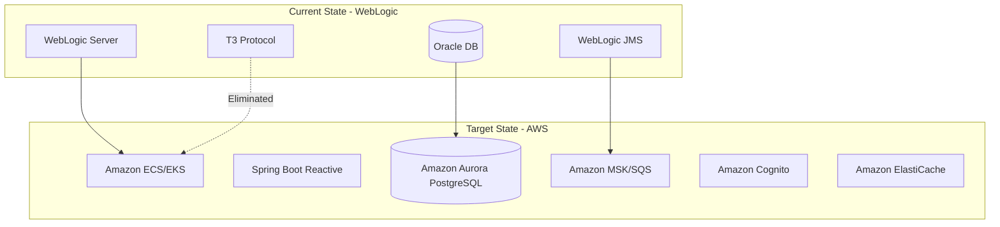

# Oracle WebLogic to Spring Boot Reactive Migration

## Objective

Migrate Oracle WebLogic Server-based J2EE applications to Spring Boot 3.x with Java 17 using a fully reactive architecture, targeting AWS container-based deployments optimized for Graviton processors.

## Platform Detection

### WebLogic-Specific Files

- `weblogic.xml` - Web application descriptor
- `weblogic-application.xml` - Application descriptor
- `weblogic-ejb-jar.xml` - EJB descriptor
- `weblogic-cmp-rdbms-jar.xml` - CMP mappings
- `weblogic-ra.xml` - Resource adapter
- `plan.xml` - Deployment plan

### WebLogic-Specific Dependencies

Scan for these package imports:
- `weblogic.*` - WebLogic APIs
- `oracle.weblogic.*` - Oracle WebLogic
- `com.bea.*` - BEA (legacy WebLogic)
- `oracle.toplink.*` - Oracle TopLink ORM

### WebLogic-Specific Code Patterns

- `weblogic.jndi.*` - JNDI extensions
- `weblogic.security.*` - Security APIs
- `weblogic.work.*` - Work Manager
- `weblogic.transaction.*` - Transaction APIs
- `weblogic.rmi.*` - RMI with T3 protocol
- `weblogic.jms.*` - JMS extensions

## Migration Strategy Bank

### Application Server → Spring Boot

| WebLogic Component | Spring Boot Equivalent |
|--------------------|------------------------|
| EJB Stateless Session Beans | Spring `@Service` with reactive return types |
| EJB Stateful Session Beans | Spring service + Redis for state |
| EJB Message-Driven Beans | Reactor Kafka / AWS SQS listeners |
| WebLogic Security | Spring Security Reactive |
| WebLogic Timer Service | Spring `@Scheduled` |
| JNDI DataSource | Spring `DataSource` bean / R2DBC |
| WebLogic JMS | Amazon SQS / MSK (Kafka) |
| CommonJ Work Manager | Reactor Schedulers |
| WebLogic Clustering | ECS/EKS + ALB |
| WLDF (Diagnostics) | Spring Boot Actuator + CloudWatch |

### Configuration Migration

| WebLogic | Spring Boot |
|----------|-------------|
| `weblogic.xml` | `application.yml` |
| `weblogic-application.xml` | Spring configuration |
| `weblogic-ejb-jar.xml` | `@Transactional` + Spring Security |
| JNDI resources | Spring beans / AWS SDK |
| `plan.xml` | Spring profiles |

### Data Access Migration

| WebLogic JPA | Spring Data |
|--------------|-------------|
| JPA with TopLink/Hibernate | Spring Data R2DBC (reactive) |
| `persistence.xml` | `application.yml` R2DBC config |
| EntityManager | R2DatabaseClient |
| JPQL queries | Native SQL / query methods |
| JTA transactions | R2DBC reactive transactions |

### Messaging Migration

| WebLogic JMS | AWS Messaging |
|--------------|---------------|
| JMS Connection Factory | Kafka/SQS connection config |
| Distributed Destinations | Kafka partitions / SQS queues |
| Store-and-Forward (SAF) | Kafka durability / SQS DLQ |
| T3 Protocol | Standard Kafka/HTTP protocols |
| XA Transactions | Saga pattern / Outbox pattern |

### Security Migration

| WebLogic Security | Spring Security Reactive |
|-------------------|--------------------------|
| Security Realm | ReactiveAuthenticationManager |
| Authentication Providers | Spring Security providers |
| Authorization Providers | Spring authorities |
| `@RolesAllowed` | `@PreAuthorize` |
| Credential Mapping | AWS Secrets Manager |
| SSL Configuration | Netty SSL / ALB TLS |

## WebLogic-Specific Risks

### Proprietary API Dependencies

| Risk | Mitigation |
|------|------------|
| T3/T3S Protocol | Replace with REST/gRPC/RSocket |
| CommonJ Work Manager | Replace with Reactor Schedulers |
| WebLogic Timer Service | Replace with Spring scheduling |
| WebLogic Security APIs | Replace with Spring Security + Cognito |
| WebLogic JMS Extensions | Replace with Kafka/SQS |
| Oracle TopLink | Replace with Spring Data R2DBC |
| WLDF | Replace with Actuator + CloudWatch |

### J2EE to Jakarta EE

- `javax.*` packages → `jakarta.*` packages
- Requires dependency updates across the board
- Spring Boot 3.x uses Jakarta EE 9+

## Implementation Phases

### Phase 0: Dependency Analysis

1. Scan for J2EE imports (`javax.ejb`, `javax.servlet`, `javax.persistence`, `javax.jms`)
2. Identify WebLogic-specific imports (`weblogic.*`, `oracle.weblogic.*`)
3. Analyze deployment descriptors
4. Identify T3 protocol usage
5. Calculate dependency density scores
6. Generate migration complexity report

### Phase 1: Project Structure Migration

1. Update to Spring Boot 3.x parent
2. Remove ALL J2EE and WebLogic dependencies
3. Remove `weblogic-client.jar`, `wlthint3client.jar`
4. Add Spring Boot reactive starters
5. Configure multi-architecture Docker build

### Phase 2: Configuration Migration

1. Remove `web.xml`
2. Migrate WebLogic deployment descriptors to `application.yml`
3. Replace JNDI lookups with Spring DI
4. Configure R2DBC data sources
5. Migrate `plan.xml` to Spring profiles

### Phase 3: EJB Migration

1. Convert Stateless Session Beans to `@Service`
2. Convert Stateful Session Beans to services + Redis
3. Migrate MDBs to reactive message listeners
4. Replace `@EJB` with constructor injection
5. Eliminate T3 protocol for remote EJB calls

### Phase 4: Data Access Migration

1. Remove `persistence.xml`
2. Configure Spring Data R2DBC
3. Convert JPA/TopLink entities to R2DBC entities
4. Rewrite JPQL to native SQL

### Phase 5: Web Services Migration

1. Convert JAX-RS (Jersey) to Spring WebFlux
2. Replace servlet filters with WebFilter
3. Eliminate HttpServletRequest/Response usage

### Phase 6: Messaging Migration

1. Replace WebLogic JMS with Kafka/SQS
2. Eliminate T3 protocol for JMS thin clients
3. Convert JMS producers to reactive publishers
4. Migrate MDBs to reactive consumers
5. Replace SAF with Kafka durability

### Phase 7: Security Migration

1. Replace WebLogic security realm with Spring Security Reactive
2. Migrate authentication providers to Cognito/LDAP
3. Replace credential mapping with Secrets Manager

### Phase 8: Container Optimization

1. Create multi-arch Dockerfile (x86_64 + ARM64)
2. Configure for AWS Java Runtime (Corretto)
3. Optimize for Graviton processors

## Code Migration Examples

### EJB to Spring Service

**Before (WebLogic EJB):**
```java
@Stateless
@TransactionAttribute(TransactionAttributeType.REQUIRED)
public class OrderServiceBean implements OrderService {
    @Resource
    private SessionContext ctx;
    
    @EJB
    private InventoryService inventory;
    
    public Order createOrder(OrderRequest request) {
        // blocking implementation with T3 remote calls
    }
}
```

**After (Spring Boot Reactive):**
```java
@Service
public class OrderService {
    private final InventoryService inventory;
    
    public OrderService(InventoryService inventory) {
        this.inventory = inventory;
    }
    
    @Transactional
    public Mono<Order> createOrder(OrderRequest request) {
        return inventory.checkStock(request.getItems())
            .flatMap(available -> saveOrder(request));
    }
}
```

### WebLogic JMS to Reactive Kafka

**Before (WebLogic JMS MDB):**
```java
@MessageDriven(activationConfig = {
    @ActivationConfigProperty(propertyName = "destinationType", 
                              propertyValue = "javax.jms.Queue"),
    @ActivationConfigProperty(propertyName = "destination", 
                              propertyValue = "jms/OrderQueue")
})
public class OrderMessageBean implements MessageListener {
    public void onMessage(Message message) {
        // blocking processing
    }
}
```

**After (Reactor Kafka):**
```java
@Component
public class OrderMessageConsumer {
    @Bean
    public Consumer<Flux<ReceiverRecord<String, Order>>> orderConsumer() {
        return records -> records
            .flatMap(record -> processOrder(record.value())
                .doOnSuccess(v -> record.receiverOffset().acknowledge()))
            .subscribe();
    }
}
```

### Work Manager to Reactor Scheduler

**Before (WebLogic Work Manager):**
```java
@Resource
private WorkManager workManager;

public void processAsync(Work work) {
    workManager.schedule(work);
}
```

**After (Reactor Scheduler):**
```java
public Mono<Void> processAsync(Runnable task) {
    return Mono.fromRunnable(task)
        .subscribeOn(Schedulers.boundedElastic())
        .then();
}
```

## AWS Target Architecture



## Oracle-Specific Migrations

### Oracle Database Options

| Current | Target | Notes |
|---------|--------|-------|
| Oracle Database | Amazon RDS Oracle | Lift-and-shift |
| Oracle Database | Aurora PostgreSQL | Cost optimization (no licensing) |
| Oracle Coherence | Amazon ElastiCache | Distributed caching |
| Oracle AQ | Amazon SQS/SNS | Message queuing |

### Oracle License Considerations

- Oracle Database licensing on AWS can be expensive
- Consider Aurora PostgreSQL for significant cost savings
- Use AWS SCT for schema conversion
- Use AWS DMS for data migration

## Validation Criteria

1. Zero J2EE/Jakarta/WebLogic dependencies in final build
2. Zero T3 protocol usage
3. Application starts with embedded Netty (not servlet container)
4. All EJBs converted to Spring reactive services
5. All data access migrated to R2DBC
6. Messaging works with Kafka/SQS
7. Security implemented with Spring Security Reactive
8. Container runs on both x86_64 and ARM64 (Graviton)
9. All tests pass with WebTestClient and StepVerifier
