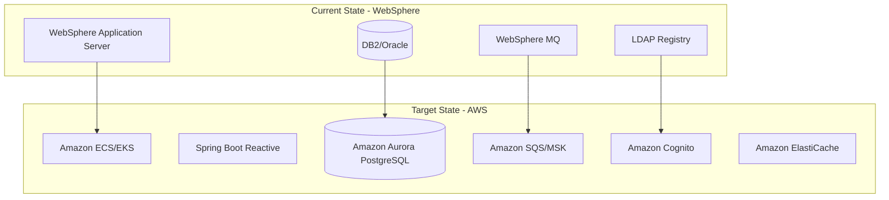

# IBM WebSphere to Spring Boot Reactive Migration

## Objective

Migrate IBM WebSphere Application Server-based J2EE applications to Spring Boot 3.x with Java 17 using a fully reactive architecture, targeting AWS container-based deployments optimized for Graviton processors.

## Platform Detection

### WebSphere-Specific Files

- `ibm-web-ext.xml` - Web module extensions
- `ibm-web-bnd.xml` - Web module bindings
- `ibm-application-ext.xml` - Application extensions
- `ibm-application-bnd.xml` - Application bindings
- `ibm-ejb-jar-ext.xml` - EJB extensions
- `ibm-ejb-jar-bnd.xml` - EJB bindings
- `was.policy` - Security policy (WebSphere traditional)
- `server.xml` - Liberty server configuration

### WebSphere-Specific Dependencies

Scan for these package imports:
- `com.ibm.websphere.*` - WebSphere APIs
- `com.ibm.ws.*` - WebSphere services
- `com.ibm.ejs.*` - EJB services
- `com.ibm.wsspi.*` - WebSphere SPI
- `com.ibm.mq.*` - WebSphere MQ native API

### WebSphere-Specific Code Patterns

- `com.ibm.websphere.security.*` - Security APIs
- `com.ibm.websphere.asynchbeans.*` - Async Beans
- `com.ibm.websphere.scheduler.*` - Scheduler Service
- JNDI lookups with WebSphere namespace
- IIOP/RMI-IIOP protocol usage

## Migration Strategy Bank

### Application Server → Spring Boot

| WebSphere Component | Spring Boot Equivalent |
|---------------------|------------------------|
| EJB Stateless Session Beans | Spring `@Service` with reactive return types |
| EJB Stateful Session Beans | Spring service + Redis for state |
| EJB Message-Driven Beans | Reactor Kafka / AWS SQS listeners |
| WebSphere Security | Spring Security Reactive |
| WebSphere Scheduler | Spring `@Scheduled` |
| JNDI DataSource | Spring `DataSource` bean / R2DBC |
| WebSphere MQ | Amazon SQS / MSK (Kafka) |
| WebSphere Async Beans | Reactor Schedulers |
| DynaCache | Spring Cache + Redis |
| WebSphere PMI | Spring Boot Actuator + CloudWatch |

### Configuration Migration

| WebSphere | Spring Boot |
|-----------|-------------|
| `ibm-web-ext.xml` | `application.yml` |
| `ibm-web-bnd.xml` | Spring Security config |
| JNDI resources | Spring beans / AWS SDK |
| `was.policy` | Spring Security policies |
| `server.xml` (Liberty) | `application.yml` |

### Data Access Migration

| WebSphere JPA | Spring Data |
|---------------|-------------|
| JPA with OpenJPA/EclipseLink | Spring Data R2DBC (reactive) |
| `persistence.xml` | `application.yml` R2DBC config |
| EntityManager | R2DatabaseClient |
| JPQL queries | Native SQL / query methods |
| JTA transactions | R2DBC reactive transactions |

### Messaging Migration

| WebSphere MQ | AWS Messaging |
|--------------|---------------|
| MQ Connection Factory | Kafka/SQS connection config |
| MQ Queues | Kafka topics / SQS queues |
| MQ Topics | Kafka topics / SNS topics |
| JMS MessageListener | Reactor Kafka / SQS async |
| XA Transactions | Saga pattern / Outbox pattern |

### Security Migration

| WebSphere Security | Spring Security Reactive |
|--------------------|--------------------------|
| User Registry (LDAP) | ReactiveAuthenticationManager |
| LTPA Tokens | JWT / OAuth2 |
| Security Roles | Spring authorities |
| `@RolesAllowed` | `@PreAuthorize` |
| Credential Vault | AWS Secrets Manager |

## WebSphere-Specific Risks

### Proprietary API Dependencies

| Risk | Mitigation |
|------|------------|
| WebSphere Async Beans | Replace with Reactor Schedulers |
| WebSphere Scheduler | Replace with Spring scheduling |
| WebSphere Security APIs | Replace with Spring Security + Cognito |
| IIOP Protocol | Replace with REST/gRPC/RSocket |
| WebSphere MQ Native API | Replace with Kafka/SQS |
| DynaCache | Replace with Redis reactive |

### J2EE to Jakarta EE

- `javax.*` packages → `jakarta.*` packages
- Requires dependency updates across the board
- Spring Boot 3.x uses Jakarta EE 9+

## Implementation Phases

### Phase 0: Dependency Analysis

1. Scan for J2EE imports (`javax.ejb`, `javax.servlet`, `javax.persistence`, `javax.jms`)
2. Identify WebSphere-specific imports (`com.ibm.websphere.*`, `com.ibm.ws.*`)
3. Analyze deployment descriptors
4. Calculate dependency density scores
5. Generate migration complexity report

### Phase 1: Project Structure Migration

1. Update to Spring Boot 3.x parent
2. Remove ALL J2EE and WebSphere dependencies
3. Add Spring Boot reactive starters
4. Configure multi-architecture Docker build

### Phase 2: Configuration Migration

1. Remove `web.xml`
2. Migrate IBM deployment descriptors to `application.yml`
3. Replace JNDI lookups with Spring DI
4. Configure R2DBC data sources

### Phase 3: EJB Migration

1. Convert Stateless Session Beans to `@Service`
2. Convert Stateful Session Beans to services + Redis
3. Migrate MDBs to reactive message listeners
4. Replace `@EJB` with constructor injection

### Phase 4: Data Access Migration

1. Remove `persistence.xml`
2. Configure Spring Data R2DBC
3. Convert JPA entities to R2DBC entities
4. Rewrite JPQL to native SQL

### Phase 5: Web Services Migration

1. Convert JAX-RS to Spring WebFlux
2. Replace servlet filters with WebFilter
3. Eliminate HttpServletRequest/Response usage

### Phase 6: Messaging Migration

1. Replace WebSphere MQ with Kafka/SQS
2. Convert JMS producers to reactive publishers
3. Migrate MDBs to reactive consumers

### Phase 7: Security Migration

1. Replace WebSphere security with Spring Security Reactive
2. Migrate user registries to Cognito/LDAP
3. Replace LTPA with JWT/OAuth2

### Phase 8: Container Optimization

1. Create multi-arch Dockerfile (x86_64 + ARM64)
2. Configure for AWS Java Runtime (Corretto)
3. Optimize for Graviton processors

## Code Migration Examples

### EJB to Spring Service

**Before (WebSphere EJB):**
```java
@Stateless
public class OrderServiceBean implements OrderService {
    @Resource
    private SessionContext ctx;
    
    @EJB
    private InventoryService inventory;
    
    @TransactionAttribute(TransactionAttributeType.REQUIRED)
    public Order createOrder(OrderRequest request) {
        // blocking implementation
    }
}
```

**After (Spring Boot Reactive):**
```java
@Service
public class OrderService {
    private final InventoryService inventory;
    
    public OrderService(InventoryService inventory) {
        this.inventory = inventory;
    }
    
    @Transactional
    public Mono<Order> createOrder(OrderRequest request) {
        return inventory.checkStock(request.getItems())
            .flatMap(available -> saveOrder(request));
    }
}
```

### JMS to Reactive Kafka

**Before (WebSphere MQ MDB):**
```java
@MessageDriven(activationConfig = {
    @ActivationConfigProperty(propertyName = "destinationType", 
                              propertyValue = "javax.jms.Queue"),
    @ActivationConfigProperty(propertyName = "destination", 
                              propertyValue = "jms/OrderQueue")
})
public class OrderMessageBean implements MessageListener {
    public void onMessage(Message message) {
        // blocking processing
    }
}
```

**After (Reactor Kafka):**
```java
@Component
public class OrderMessageConsumer {
    @Bean
    public Consumer<Flux<ReceiverRecord<String, Order>>> orderConsumer() {
        return records -> records
            .flatMap(record -> processOrder(record.value())
                .doOnSuccess(v -> record.receiverOffset().acknowledge()))
            .subscribe();
    }
}
```

## AWS Target Architecture



## Validation Criteria

1. Zero J2EE/Jakarta/WebSphere dependencies in final build
2. Application starts with embedded Netty (not servlet container)
3. All EJBs converted to Spring reactive services
4. All data access migrated to R2DBC
5. Messaging works with Kafka/SQS
6. Security implemented with Spring Security Reactive
7. Container runs on both x86_64 and ARM64 (Graviton)
8. All tests pass with WebTestClient and StepVerifier
